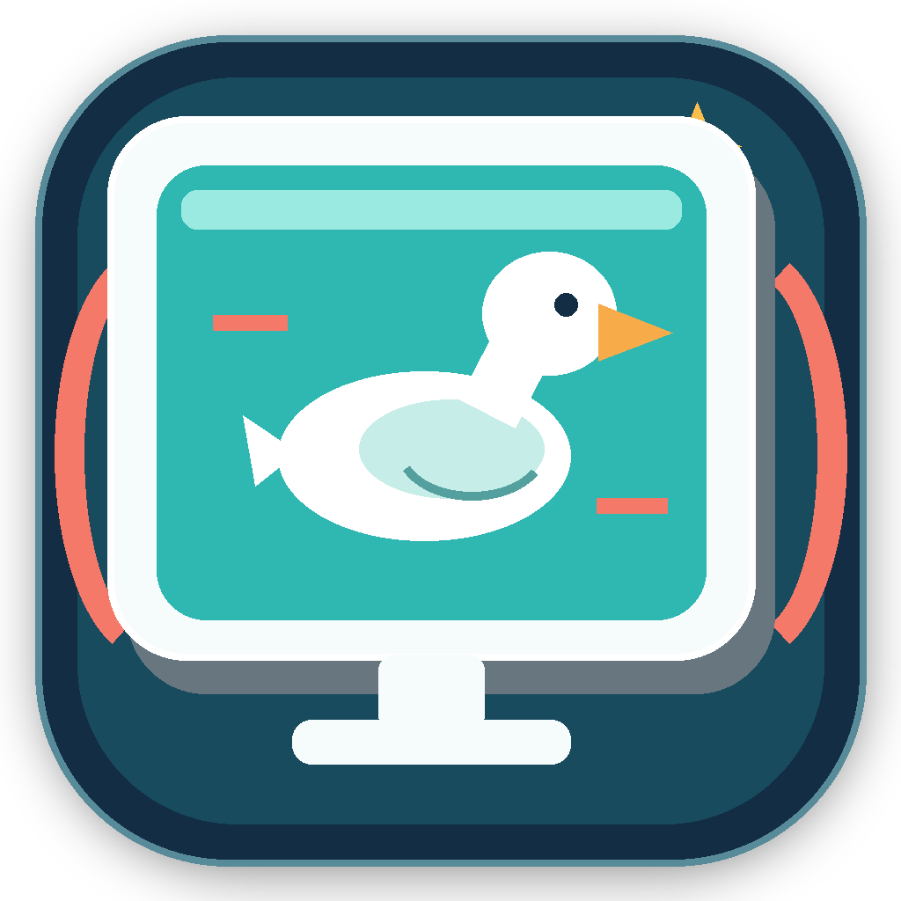

<div align="center">
  
  <h1>抓大鹅 · 晃屏助手</h1>
  <p>Windows 下的抓大鹅小程序拖动辅助工具</p>
  <p>
    <a href="./dist/DaeShake.exe">下载 DaeShake.exe</a>
    &nbsp; · &nbsp;
    <a href="#快速开始">快速开始</a>
    &nbsp; · &nbsp;
    <a href="#输入异常排查">排查问题</a>
  </p>
</div>

---

## 项目简介

DaeShake 会在抓大鹅小程序所在窗口的客户区内模拟连续的左键拖动，贴近“拖动屏幕完成摇晃”的操作方式。

工具不读取或修改游戏进程，只负责发送鼠标拖动输入。程序为单文件绿色版，目标电脑不需要安装 Python。

## 快速开始

1. 下载 [`dist/DaeShake.exe`](./dist/DaeShake.exe)。
2. 打开微信和抓大鹅小程序，让抓大鹅小程序保持在前台。
3. 启动 `DaeShake.exe`，按 `Ctrl+Alt+F8` 晃动一次。

也可以在工具中点击“自动找抓大鹅”，确认目标窗口后点击“晃一下”。

## 功能一览

| 功能 | 说明 |
| --- | --- |
| 多种轨迹 | 水平往返、垂直往返、顺时针圆形、逆时针圆形、八字轨迹 |
| 强力预设 | 默认 `200 px / 280 ms / 2 次`，开箱即可使用 |
| 自定义参数 | 调整拖动距离、持续时间、重复次数和起点位置 |
| 自然归位 | 每条轨迹自身闭合，移动距离相互抵消，不额外强制拉回窗口 |
| 坐标稳定 | 使用绝对屏幕坐标，不受系统鼠标速度和加速度设置影响 |
| 窗口适配 | 自动限制轨迹范围，避免拖动起点或路径跑出客户区 |
| 输入兼容 | `自动`、`标准`、`兼容`三种输入方式 |
| 保护机制 | 拖动超时自动释放左键，支持 `Ctrl+Alt+F9` 急停 |

## 参数速览

| 参数 | 推荐值 | 作用 |
| --- | ---: | --- |
| 模式 | 强力 | 使用预设的高强度拖动参数 |
| 拖动距离 | 200 px | 每次向左右或上下移动的距离 |
| 持续时间 | 280 ms | 整段轨迹的持续时间，越短越快 |
| 重复次数 | 2 次 | 只允许偶数次：`2 / 4 / 6 / 8` |
| 起点 | 顶部中心 | 从抓大鹅客户区顶部中央开始 |
| 顶部偏移 | 20 px | 从客户区顶部向下避开工具栏 |

切换到“自定义”后，修改的参数会自动保存。垂直模式会自动调整起点和轨道，连续点击时也会避免完全重复的手势。

## 全局快捷键

| 快捷键 | 操作 |
| --- | --- |
| `Ctrl+Alt+F7` | 将当前前台窗口锁定为目标 |
| `Ctrl+Alt+F8` | 触发一次晃动 |
| `Ctrl+Alt+F9` | 立即释放鼠标并停止拖动 |

## 输入异常排查

如果鼠标会移动但抓大鹅没有反应：

1. 确认抓大鹅小程序本身在前台，而不是微信其他页面或浏览器页面。
2. 在工具中将“输入方式”切换为“兼容”后重试。
3. 确认微信和 DaeShake 使用相同的权限级别，不要只给其中一个程序使用管理员权限。

仍然无法使用时，可以运行 [`DaeInputDiagnostic.exe`](./dist/DaeInputDiagnostic.exe)，测试 Windows 是否能接收模拟鼠标输入。

## 开发与构建

开发调试：

```powershell
py screen_shaker.py
```

构建发布版：

```powershell
build.bat
```

构建完成后，发布文件位于 `dist/`，其中 `DaeShake.exe` 是主程序，`DaeInputDiagnostic.exe` 是独立诊断工具。

## 项目结构

```text
screen_shaker.py        主程序
input_diagnostic.py     输入诊断工具
build.bat               构建脚本
dist/                   可直接运行的 exe
ui_icons/               界面图标
app_icon.ico            应用图标
```

<div align="center">
  <sub>送给 s 的七夕礼物。</sub>
</div>
